####  Project Mentor: Raj Vansia
####  Team Members: Nicholas Kousen, Wanhu Tang, Jibiao Li, Chuqiao Dong, Zhao Huang, and Aditi Shetty

# Project Research
##  Industry Problem
 “Malnutrition (undernutrition) occurs among approximately 3 percent of adult hospital inpatient stays in the United States...” [3] (Weiss 2016).
  
  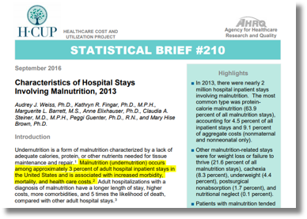
  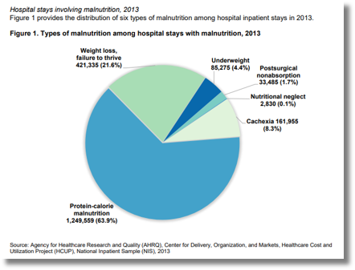
  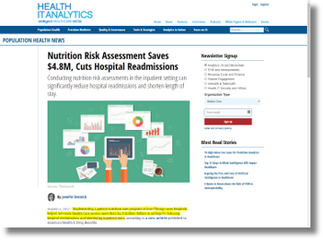
  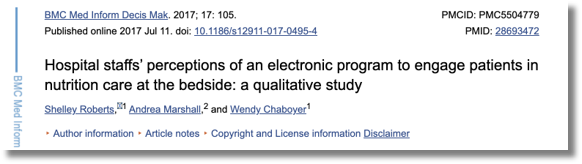

##  Domain Gaps
  “Implementing a patient nutrition care program at four Chicago-area hospitals helped Advocate Health Care accrue more than $4.8 million dollars in savings by reducing hospital
readmissions and shortening inpatient stays...” [1] (Bresnick 2017).

##  End User Interviews
  Hospital staff reacted positively to electronic patient nutrition tools Hospital staff felt that the tools were easy to use and understand Hospital staff recognized the benefits for both patients and doctors
This inlcuded improved patient quality of care (Roberts 2017) [2]

# Project Goals & Requirements
  * Who?	→ Patients, physicians, and clinical staff
  * What?	→ Tool to provide personalized meal recommendations
  * When?	→ During a patient’s hospital stay
  * Where?	→ On a web application interface
  * Why?	→ To promote a safer and healthier hospital stay
  * How?	→ Through automatic filtering and user-friendly UI

# View

## Connect to Patient Nutrition Tool
 Patient Nutrition Tool is an amazing web application to ensure customized nutrition and restriction needs of patients.
 To use the web application, simply open a web browser and enter url: https://apps.hdap.gatech.edu/pntapp/.
 
##  Login and Sign up
 Patient Nutrition Tool is designed to use for both clinical administrative staff and patients to order food based on patient nutrition needs and restriction.
 Once connected to the main page, the user will see a Sign Up and Log In button. If the user has never signed up before, please click on the Sign Up to sign up. The user should be already entered to the database by the database administrator.
 
 Depending on the user type, the Sign Up page have two options. Click Admin for clinical staff and Patient for patients to sign up. On the Admin Sign Up or Patient Sign Up page, enter the following information:

 First Name: please enter your REAL name as recorded in the database to sign up, otherwise the user won't be able to sign in.
 Middle Name: please enter your REAL middle name; this can be left blank
 Last Name: please enter your REAL name as recorded in the database to sign up, otherwise the user won't be able to sign in.
 username: please enter a username
 password: please enter a password
 After all the information is entered, click the Sign Up button to finish the sign up process.

 Log in
  The Log In button is available on the home page, Sign Up page, Admin Sign Up page and Patient Sign Up page. Depending on the user type, the Log In page have two options. Click Admin for clinical staff and Patient for patients to Log In. On the Admin Log In or Patient Log In page, enter the following information:

 username: please enter a username
 password: please enter a password
 
  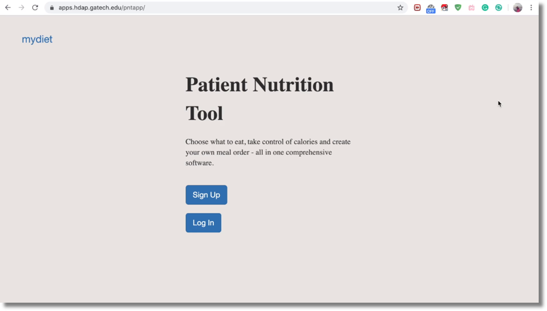
  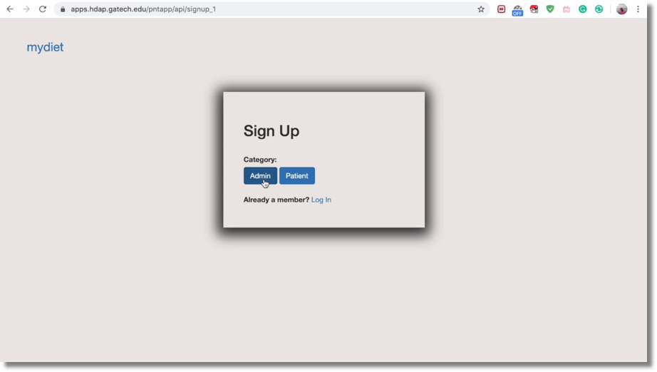
  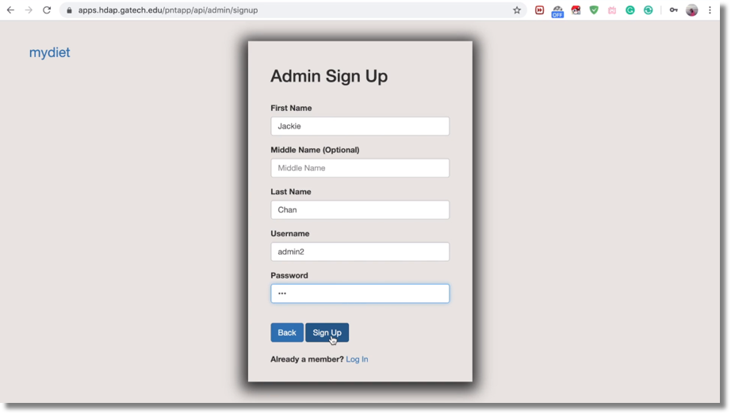
  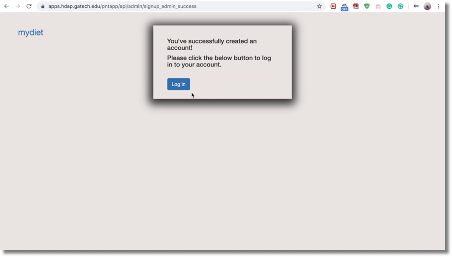
  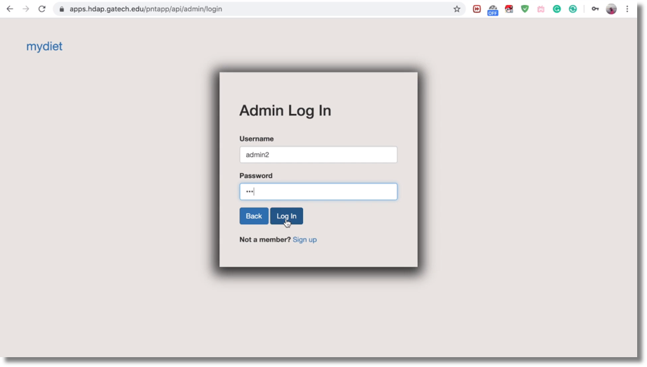
  
##  Admin View
 If the user logged in is an administrative staff, the user will be directed to the admin view homepage. Meal orders of all patients will be displayed here. For each order, Patient Name, Gest ID, whether the order is Doctor Approved, Meal Type and Ordered Food, Order Date.

 Clicking the Log Out button in the upper right corner will log the user out and direct the user to the mainpage.

  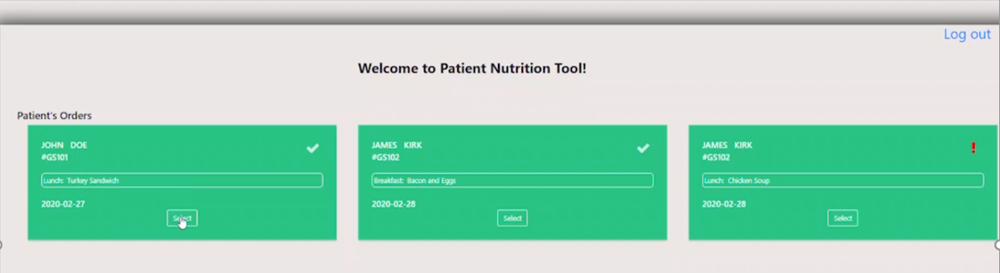
  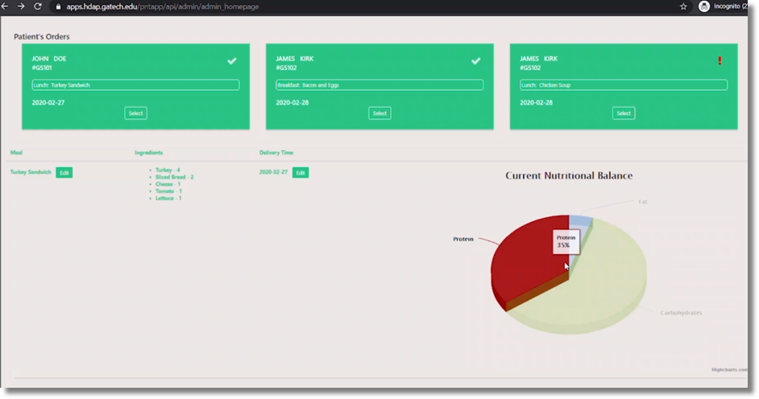
  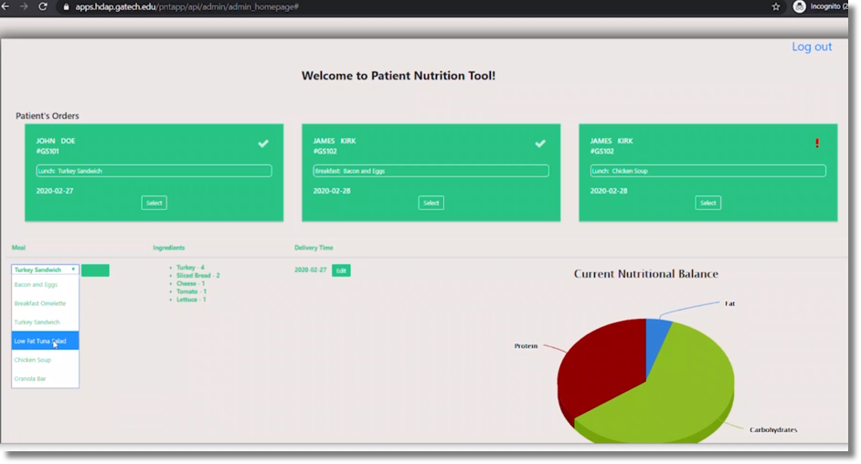
  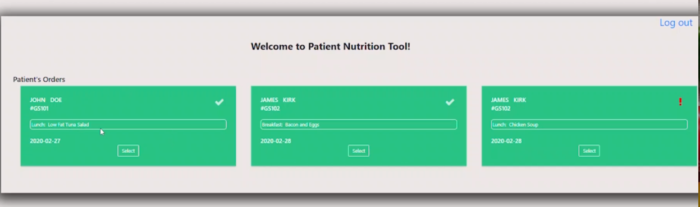
  
##  Meal Order View
 If the user logged in is a patient, the user will be directed to the patient view homepage. Meal orders for that patient will be displayed here, including First Name, Last Name, Allergen, All Meal Orders. For each order, Order Type, Food, Calories and Price will be displayed. In addition, Available Meal is also displayed. For each existing meal order, click Delete button will delete the order. For available meal order, click the ADD button will add the order to the existing order.

 Clicked the Log Out button in the upper left corner will log the user out and direct the user to the mainpage.

  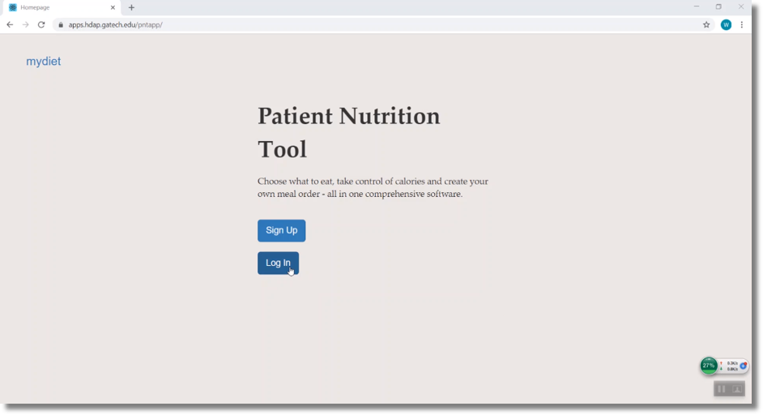
  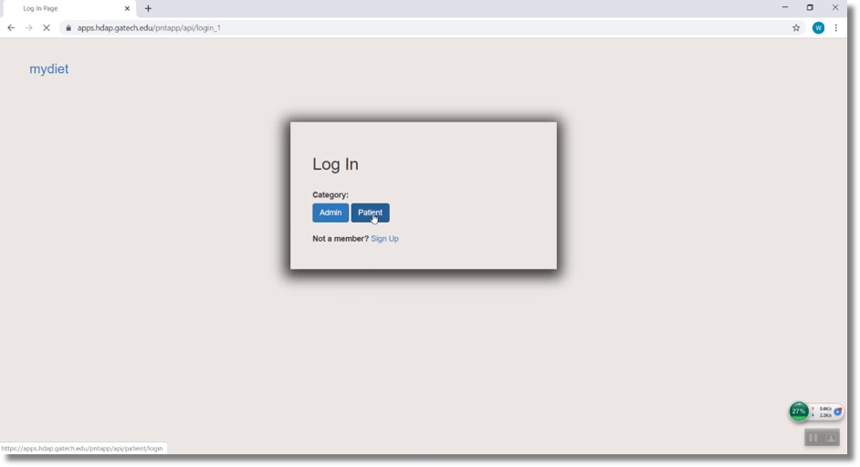
  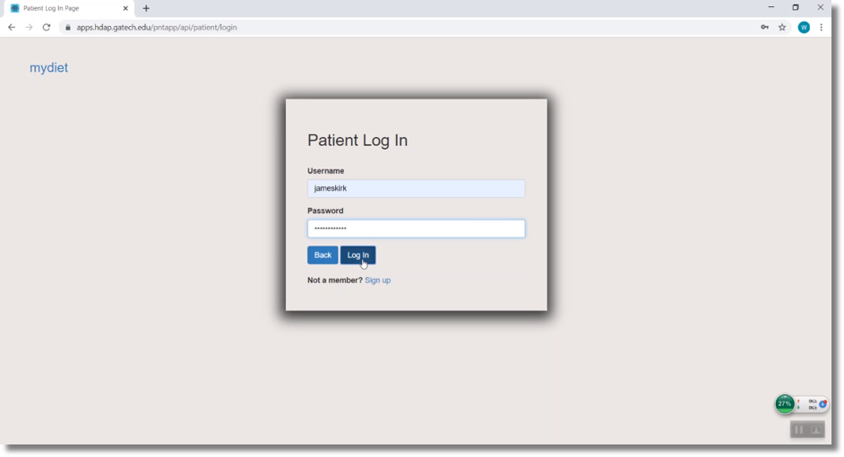
  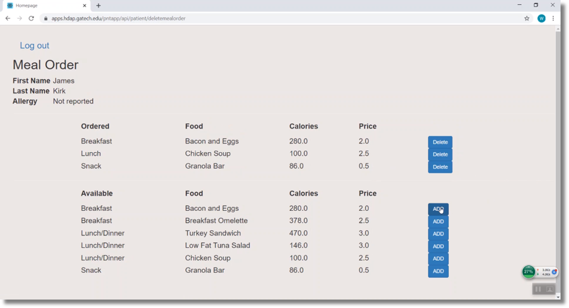
  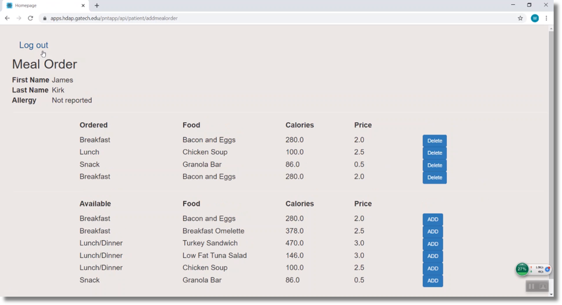
  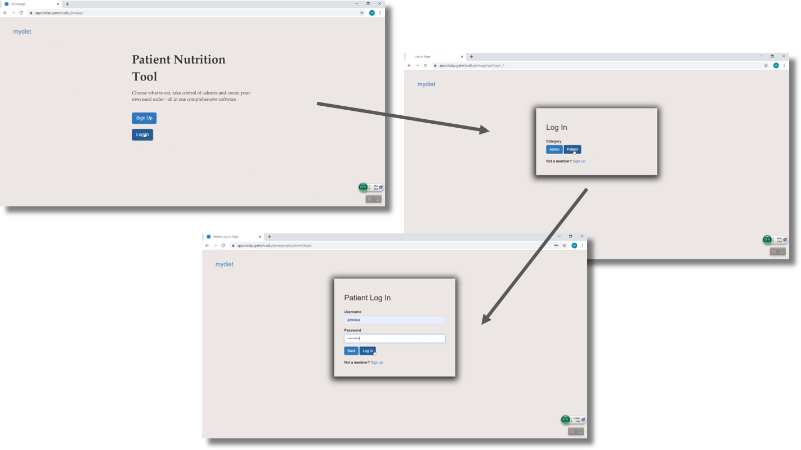
  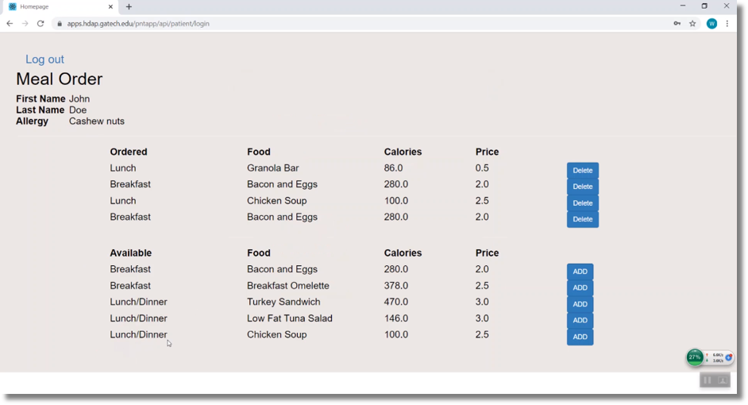
  
  
# Database Table
  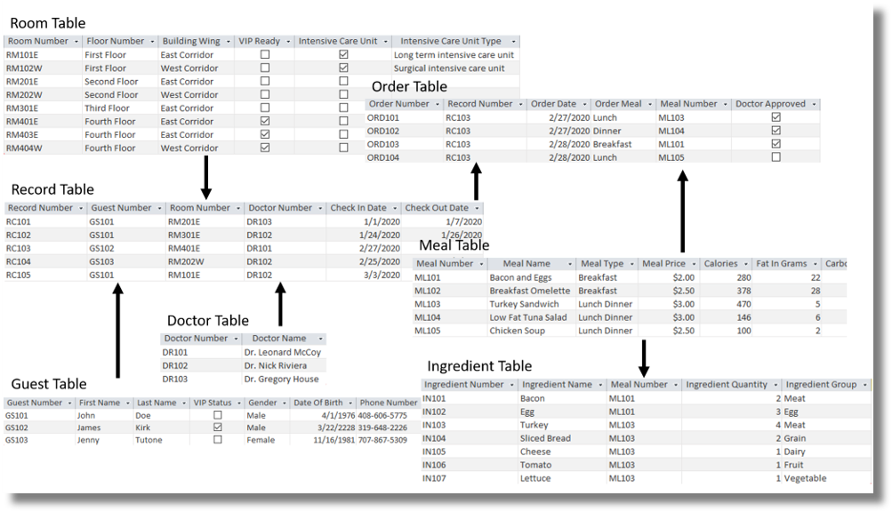
  
##  Table Relationships
   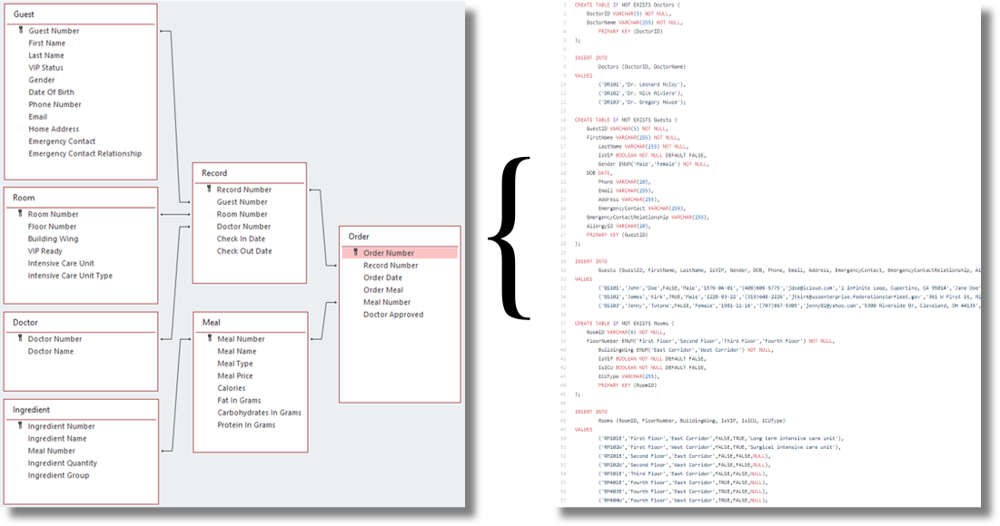
   
# Deployment Pipeline
  
  
# Discussion of Future Plans and Opportunities
  * Include additional application functionalities
    * VIP feature to alias celebrities and protect their privacy
    * Order status updates to track meal delivery completion
    * Integration with additional nutrition and food records
  * Expand application support for use on mobile and tablet devices
  * Conduct user interviews and surveys for application feedback

# References
[1] Bresnick, J. (2017). Nutrition Risk Assessment Saves $4.8M, Cuts Hospital Readmissions. Xtelligent Healthcare Media, LLC. Retrieved from https://healthitanalytics.com/news/nutrition-risk-assessment-saves-4.8m-cuts-hospital-readmissions.

[2] Roberts, S., Marshall, A., & Chaboyer, W. (2017). Hospital Staffs’ Perceptions of an Electronic Program to Engage Patients in Nutrition Care at the Bedside: A Qualitative Study. BMC Medical Informatics and Decision Making. Retrieved from https://bmcmedinformdecismak.biomedcentral.com/articles/10.1186/s12911-017-0495-4.

[3] Weiss, A. J., Fingar, K.R., Barrett, M.L., Elixhauser, A., Steiner, C.A., Guenter, P., & Brown, M.H. (2016). Characteristics of Hospital Stays Involving Malnutrition. Agency for Healthcare Research and Quality. Retrieved from http://www.hcup-us.ahrq.gov/reports/statbriefs/sb210-Malnutrition-Hospital-Stays-2013.pdf.

